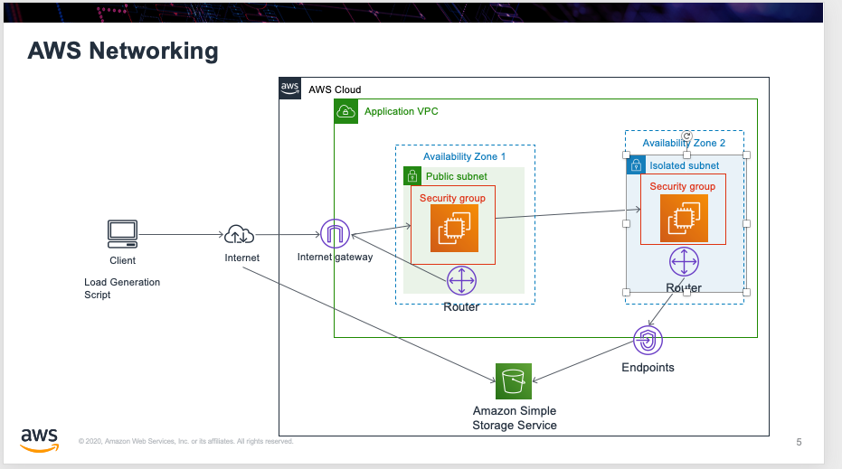

# AWS Networking Challenge

See the diagram in the docs folder

The idea is to create a network as shown in the diagram.

Either through the console or using CDK.

Create a VPC with 2 subnets ( private, isolated ).  Create an EC2 instance
in each subnet.

In the public subnet allow SSH traffic.

In the Isolated subnet, allow the security group associated with the public EC2
to SSH into the private EC2.

On the private EC2 instance, issue the following command:

`aws s3 ls`

To see if you can get a list of S3 buckets.

